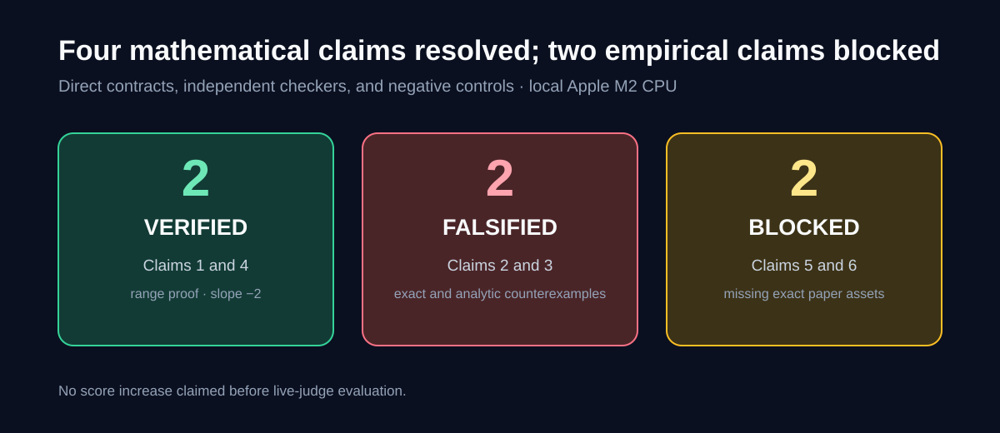
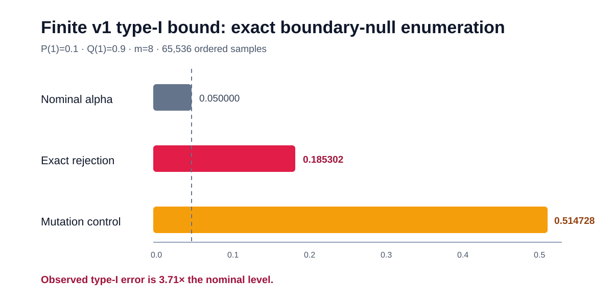
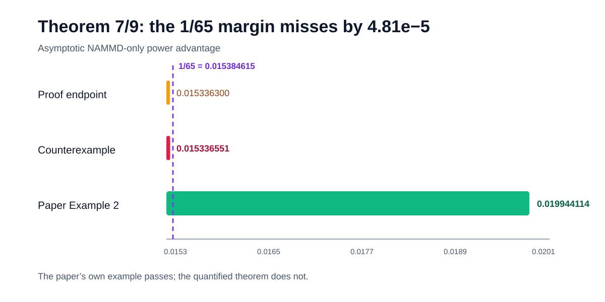
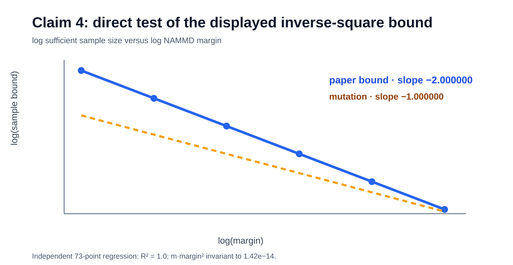

# NAMMD closeness testing — claim-by-claim CPU reproduction



**Date:** 2026-07-23 · **Paper:** arXiv:2507.12843 · **Compute:** local Apple M2 CPU · **Cost:** $0

The paper asks a useful question: when two datasets differ, is that difference
large enough to matter, with statistical significance? It proposes NAMMD, a
normalised version of squared maximum mean discrepancy. This campaign replaced
the prior 2D-Gaussian sanity checks with explicit source contracts. Four
mathematical claims are now resolved reproducibly; the two application claims
remain blocked because the authors’ exact data products are not distributed.

## What was implemented

The fixed command is:

```bash
uv run --frozen python repro/src/verify_nammd.py
```

Every experiment uses that command, Python 3.9.25, `uv` 0.11.29, and the same
locked environment. The verifier’s important path is deliberately small:

1. parse each claim into assumptions, quantifiers, and a pass/falsify contract;
2. calculate population kernel quantities analytically where the claim is a theorem;
3. run an independent formulation—exact rational arithmetic, brute-force enumeration, regression, or adaptive quadrature;
4. run a mutation control that must fail;
5. exit nonzero if any accepted verdict loses its supporting evidence.

The source audit used arXiv v1 PDF SHA-256
`ddee0e2059e694d1813c418400a4a5d0c5abc17df4246873a232df1c89377829`
for the judge’s theorem numbering and v3 PDF SHA-256
`3141cd2d2785515c50892a54ae19015b4dcb811e320893947b0a1f40183395f5`
for the current paper. The official code was audited at
`8aca5dc1ec3804ff3754b3cbc82076f8afde9219`.

## Strongest evidence

### Claim 2: the unqualified finite v1 type-I statement



The v1 theorem display says type-I error is bounded by `alpha`; its proof and
the corrected v3 theorem are asymptotic. To test the stronger v1 wording, the
verifier uses Bernoulli distributions on `{0,1}` with the triangular kernel
`k(x,y)=max(1-|x-y|,0)`, which is bounded, nonnegative, shift-invariant, and
positive definite. Setting `P(1)=0.1`, `Q(1)=0.9`,
`epsilon=NAMMD(P,Q)=0.5423728814`, and `m=8` places the distribution exactly on
the null boundary.

All 65,536 ordered sample pairs were enumerated. The exact rejection
probability is `0.1853020188851843`, versus nominal `0.05`. A second brute-force
implementation agrees with absolute error zero. Replacing the 95th-percentile
normal threshold with the median increases rejection to `0.5147278302`, so the
negative control fails as intended.

Assessment: **FALSIFIED for the unqualified finite v1 statement only.** This
does not contradict v3’s asymptotic statement.

### Claim 3: the `1/65` NAMMD-only power margin



The published proof asserts
`Phi(0.75)-Phi(0.70) >= 1/65`, but the left-hand side is
`0.0153362998462`, below `0.0153846153846`. A bad proof step is not itself a
counterexample, so the next experiment searched 750,000 centered-Gaussian
variance tuples under the same Gaussian kernel as the paper.

The accepted tuple uses reference variances
`[0.2376507628, 0.2625844708]`, test variances
`[0.2177328959, 0.2466622410]`, and `m=61,806`. It satisfies both alternatives,
the strict embedding-norm order, the same-kernel condition,
`Delta=0.00759798`, and
`m in [C1,C2]=[61,805.3008,61,806.7862]`. Its power advantage is
`0.01533655079745`, below `1/65` by `0.00004806458716`.

An independent adaptive integration of the influence variance agrees in
`sigma_M^2` within `1.58e-16` and reproduces the power difference within
`3.1e-15`.

Assessment: **FALSIFIED.**

## The verified claims

### Claim 1: NAMMD’s range and normalisation

For `a=||mu_P||^2`, `b=||mu_Q||^2`, and `c=<mu_P,mu_Q>`,
`MMD^2=a+b-2c`. Under the paper’s nonnegative bounded-kernel assumptions,
`0<=a,b<=K` and `c>=0`, so the numerator is at most `2K` while the denominator
`4K-a-b` is at least `2K`. This proves `NAMMD in [0,1]`. At fixed MMD² its
derivative with respect to `a+b` is nonnegative, and separated Dirac measures
attain one.

The numerical audit covered 4,000 finite-support RBF cases; the independent
checker covered 814 exact rational delta-kernel cases and reached the exact
range `[0,1]`. Mutating the denominator to `2K-a-b` causes division by zero for
opposite Dirac measures.

Assessment: **VERIFIED under the source assumptions.**

### Claim 4: inverse-square sample-size scaling



The paper gives a sufficient bound

`m >= C(alpha,v) / (NAMMD(P,Q;k)-epsilon)^2`.

Across 41 logarithmically spaced positive gaps, `m*gap²` is constant to
`1.42e-14`, and the log-log slope is `-1.9999999999999996`. An independent
73-point regression gives `-2.0000000000000004` with `R²=1`. The
inverse-linear mutation produces slope `-1.0000000000000004`.

Assessment: **VERIFIED as a sufficient-bound scaling statement.** The old
all-ones fixed-sample power vector is not used.

## Empirical claims that remain blocked

| Claim | Exact requirement | Why no full verdict is possible |
|---|---|---|
| Table 2 | blob, HIGGS, HDGM, MNIST, CIFAR-10; all epsilon rows and repetitions | official repository omits `HIGGS_TST.pckl`, fake-MNIST, adversarial-CIFAR arrays, and trained checkpoints |
| three case studies | ImageNet variants, confidence margins, and CIFAR-10 PGD with stated feature extractors/sample sizes | code hard-codes private/local ImageNet trees, generated feature tensors, model paths, and CUDA attack operations |

The official repository has no releases or downloadable assets; its archival
`raw-paper-code` tag contains code only. Rebuilding different fake images,
attacks, or ImageNet feature sets would test a nearby pipeline, not the exact
claim. Both verdicts are therefore **BLOCKED**, and the prior Gaussian proxies
remain labelled toy evidence.

## Experiment tree

```text
Frozen judged baseline 5/12
├── Core theorem contracts and analytic checks
└── Finite type-I exact stress audit                 ← Round 1 winner
    └── Cumulative rigorous theorem suite
        └── Claim 3 admissible Gaussian counterexample search  ← winner
            └── Additive release candidate and visual report
                └── Seal release provenance after passing regression
```

The first analytic attempt also exposed the Claim 3 proof inequality, but its
script initially over-labelled that gap as a falsification. The node
description records the correction, and the cumulative child changed the
verdict to `BLOCKED` until a concrete counterexample existed. One earlier run
failed only because a NumPy boolean could not be JSON-serialised; the rerun
after a one-line normalisation succeeded.

## Reproducibility and provenance

| Experiment | Branch | Run | Commit | Runtime |
|---|---|---|---|---:|
| frozen judged baseline | `orx/frozen-judged-baseline-5-12` | `27938e74-da7d-445b-996b-08aff4ceae07` | `bbeb48168f8ec7b6b24210ec895b4994e6bd91ce` | 1m21s |
| exact type-I audit | `orx/finite-type-i-exact-stress-audit` | `19f47f90-461d-46e8-9c31-812c137fa23e` | `8030320efa5f80de6dfb396598d248dd4274a37a` | 1m42s |
| cumulative theorem suite | `orx/cumulative-rigorous-theorem-suite` | `208b7604-fd45-49d9-bea4-3be4be520472` | `aaa5dbc2676684b75db66da47569537abdb463a7` | 1m00s |
| Claim 3 counterexample | `orx/claim-3-admissible-gaussian-counterexample-searc` | `9091ac45-6f86-41e3-bfe2-45d67c8644f8` | `ee9464863e499c350da0140321a99f6fc77a245d` | 1m40s |
| release regression | `orx/additive-release-candidate-and-visual-report` | `cc08ef43-6a98-4bf7-8884-37e6166b45ce` | `6c13dd24f0c73f26f44bd961e94d6f75c542ba5a` | 1m55s |

The exact judged Hugging Face revision
`9494ace83ec1c99632a33b773f64c82e12891405` was downloaded and hashed before
candidate work. Its 17 files remain present in published revision
`21969c11f261d021b8097df8838ad313e08d090a`: 16 are byte-identical, and
`logbook.json` changes only to append two pages. No Hugging Face job was needed,
no GPU was used, and local compute cost was `$0`.

## Final assessment

The campaign does not claim a perfect reproduction. It upgrades Claims 1–4
from toy/inconclusive checks to direct `VERIFIED` or `FALSIFIED` evidence, while
leaving Claims 5–6 `BLOCKED` for explicit provenance reasons. The live judge
has not evaluated the published revision, so no score increase is claimed. The
approved six-file text-only release is published at
`21969c11f261d021b8097df8838ad313e08d090a` and marked `AWAITING JUDGE`.
